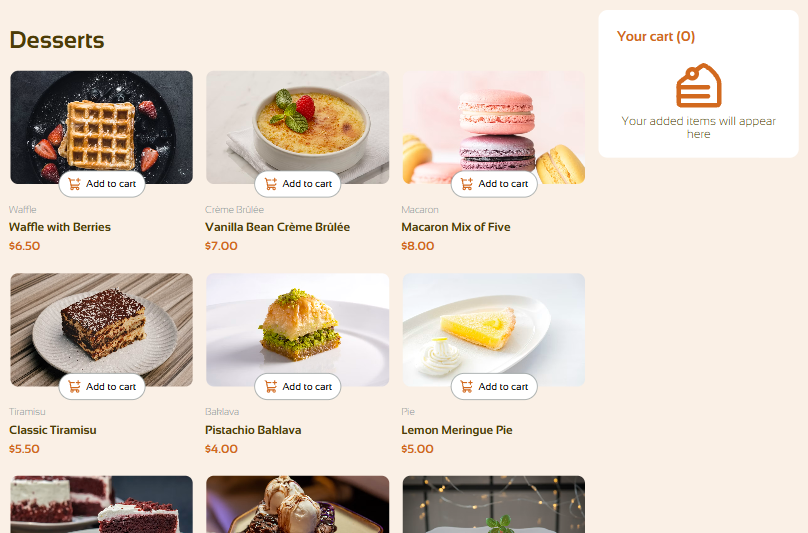
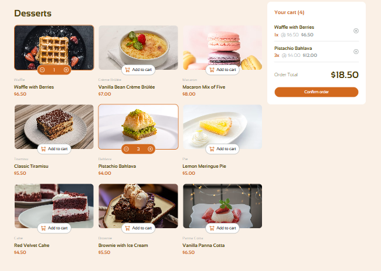
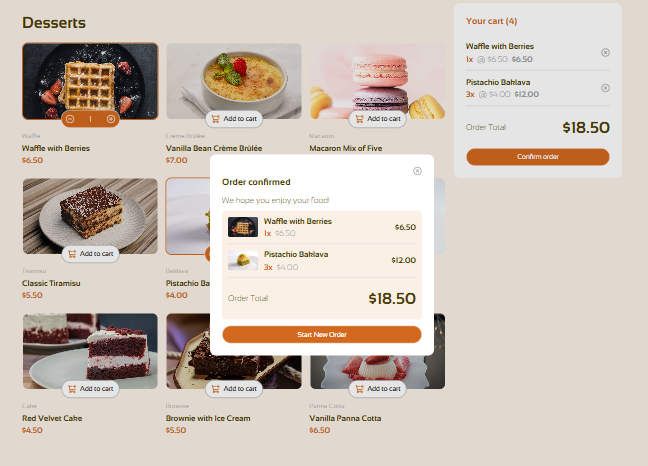
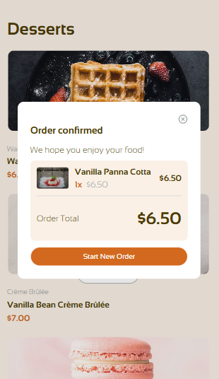

# Product List with Cart
A responsive e-commerce product listing application built with React and TypeScript. Users can browse available desserts, add products to their cart, update quantities, remove items, and confirm their order.

[Demo](https://melissa-mill.github.io/product-cart/)

## Features
- Responsive layout for desktop and mobile devices
- Display a list of dessert products
- Add products to the shopping cart
- Increase or decrease product quantities
- Remove products from the cart
- Calculate the order total
- Display an order confirmation modal
- Start a new order after completing a purchase
- Type-safe product and cart data using TypeScript

## Technologies
- React
- TypeScript
- HTML5
- CSS3
- Vite

## Project Structure
The application is organized into reusable React components:

- `Dessert` — displays individual products and their cart controls
- `Cart` — displays selected products and the order total
- `Modal` — displays the order confirmation
- `data` — contains the product data
- `types` — contains TypeScript interfaces

## Screenshots
### Desktop

### Mobile

